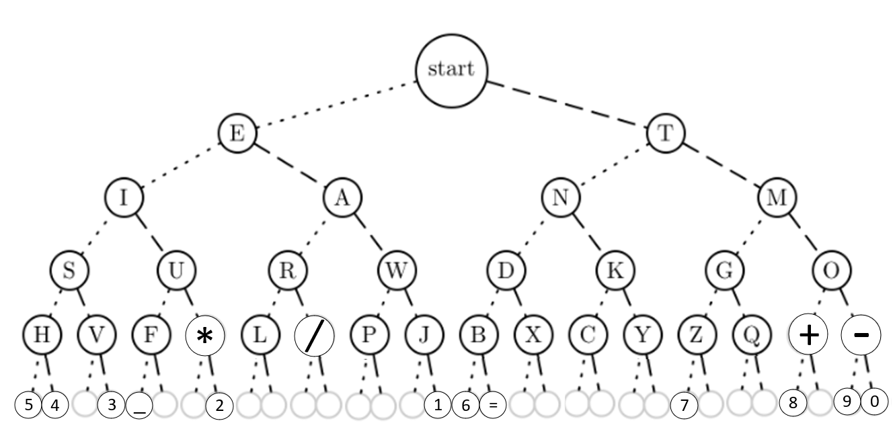
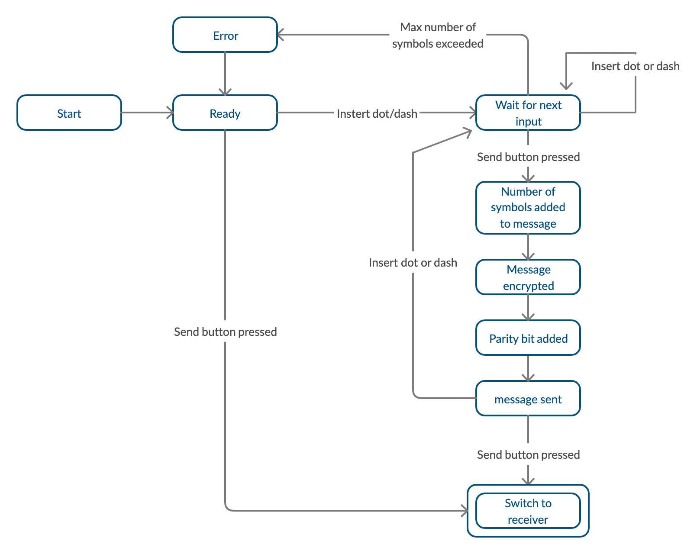
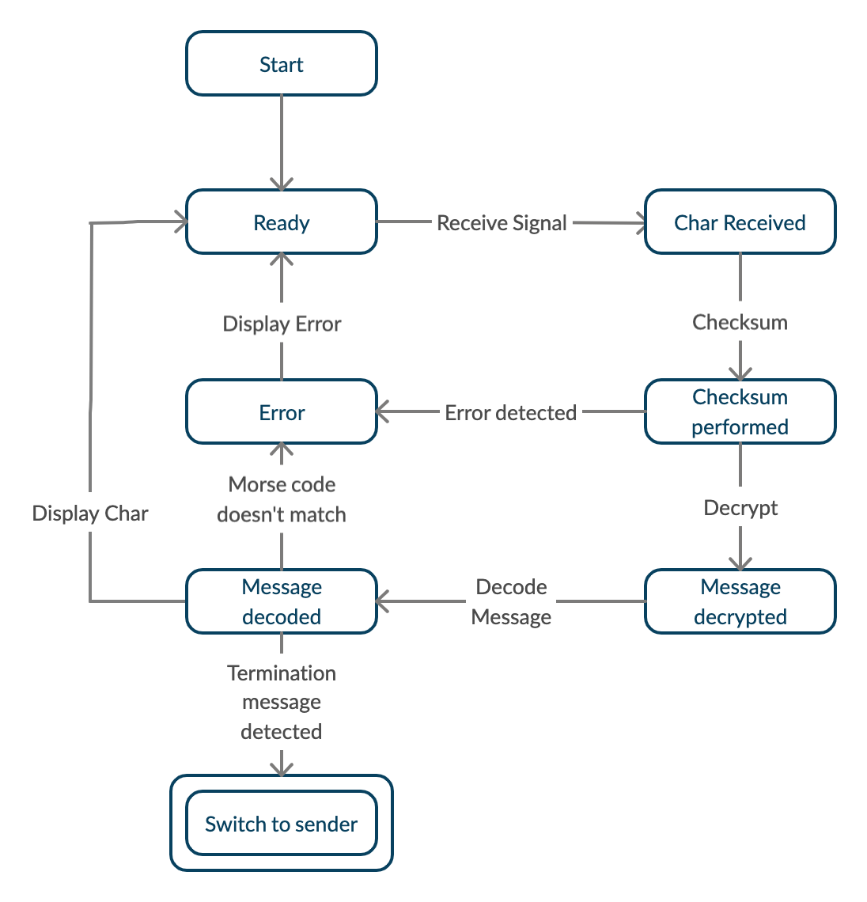

# README.md

### Data encoding and decoding
This program is used to send morse code information between one micro:bit to another. The sender will write one character in morse code at the time, and then press a button to send it to the other device. The receiving device will be responsible to understand the message received and decode it into an ASCII letter. To perform this operation the ASCII characters are saved into a tree, so that the decoding of the message will be easier.


## Building Instructions
Files to Download
/source/
main.cpp - Main application code
module.json - Contains instructions for yotta on how to build
Commands Required Initially
yt target bbc-microbit-classic-gcc
yt build
Running Instructions
The executable can be found inside /build/bbc-microbit-classic-gcc/source, with the executable being named project_name-combined.hex
Copy this file to /media/student/MICROBIT

### Instructions
To connect the 2 Microbits we need 2 alligator clips. For the data transmission we use digital signal, which means that both Microbits need to share the same GROUND and PIN in order to establish communication. In our code we use Pin number 0 but any Pin is fine to use as soon as we change the Pin number in the code to the pin number of your choice. To start we need to compile the code for the receiver with the Boolean named receiver as false and then do the same for the second Microbit this time changing the value to true.
```c++
//Sender if false/ receiver if true
bool receiver = false;
```
---

### Transmission
 First The Microbit detects if a long or short click occures, to chose between the dot and dash symbol. The dot symbol will indicate to the receiver to traverset the left edge of the tree, oppositaly, if the dash symbol is chosen, the receiver will know to traverse the tree in the right direction. 
 For convenience we use button B to trigger the transmission of the Morse code that has been recorded up to that point. When an event on button B occurs the message stored on the buffer is encrypted, after which, the parity bit is added to the data packet, and finally the message is sent to the receiver where the message will be decoded and decrypted.

### Data packet
The message is stored in a 9 bit data packet where the first 3 bits represent the length of the message, followed by the parity bit and the last 5 bits that represent the actual message(array).

<table>
    <thead>
        <tr align="center">
            <th colspan=10><b>Data Packet</b></th>
        </tr>
    </thead>
    <tbody>
        <tr>
            <td><b>Binary representation:</b></td>
            <td>1</td>
            <td>0</td>
            <td>0</td>
            <td>1</td>
            <td>0</td>
            <td>1</td>
            <td>1</td>
            <td>0</td>
            <td>0</td>
        </tr>
        <tr align="center">
            <td align="left"><b>Meaning:</b></td>
            <td colspan=3>Message Length bits</td>
            <td colspan=1>Check</td>
            <td colspan=4>Message bits</td>
            <td rowspan=2>Excess bit</td>
        </tr>
        <tr align="center">
            <td align="left"><b>Decoded value:</b></td>
            <td colspan=3>4</td>
            <td colspan=1>even</td>
            <td colspan=4>P</td>
        </tr>
    </tbody>
</table>

We chose this approach knowing that our tree has 5 layers so anything more than 5 inputs would 
be an error. To represent an-layer tree where n < 9 we can simply grow the message array and adjust the error messages but anything more than that will require another bit added to the length since the maximum number represented by 3 bits is 8.

---
#### Usage:
#####  Write a Dot
When button A is pressed for short duration(approx. anything less than 1 sec) and released it triggers an event whose pulse is calculated by the Difference of the total sleep minus the sleep time for the dot. 
#####  Write a Dash
When button A is pressed for long duration(approx. anything more than 1 sec) and released it triggers an event whose pulse is  calculated by the Difference of the total sleep minus the sleep time for the dash.
##### Encryption
The encryption is performed using XOR. The message section of the packet, before 		being sent, is encrypted by executing a bitwise XOR operation between the 			message and the key. The packet header is left decrypted for the receiver to 	“understand” it.	
##### Parity Checksum
A checksum is accomplished using a ParityBit. Before being sent, the number of 1s 		in the packet is counted, and the parity bit will be set accordingly to have the total 	number of 1s even.
Upon the packets arrival, the total number of ones will be checked again, and an 		error during transmission will be revealed if the resulting count is odd. 
This method is effective for checking small packets of data where multiple errors 		during a single transmission are unlikely to happen. However this method will not 		be able to fully guarantee the integrity of the data.	
##### Decryption
After gathering and decoding the header information from the packet, the message 	section is decrypted.To do this a bitwise XOR is performed between the encrypted 		message and the key, revealing the information of the message.
### Modes
To change mode the sender must simply press the button B when the buffer is empty. This will send an empty message to the receiver that will know to switch mode to sender.

**Final state machine showing the workings of the sender:**


**Final state machine showing the workings of the receiver:**

---

NOTE:
1 Since a debugging tool wasn’t use for that code many of the print statement used for testing are commented but still inside the code and others are left for demonstration purposes.
2 The granularity of the sleep function is 6 ms so the actual time of the sleep functions should be calculated when the number is divided by 6. E.g (sleep(120) is actually  a  20 ms sleep)
3 Encryption occurs only on the last 5 bits of the message which holds the actual message 


Deyvid Gueorguiev
Giacomo Pellizzari
